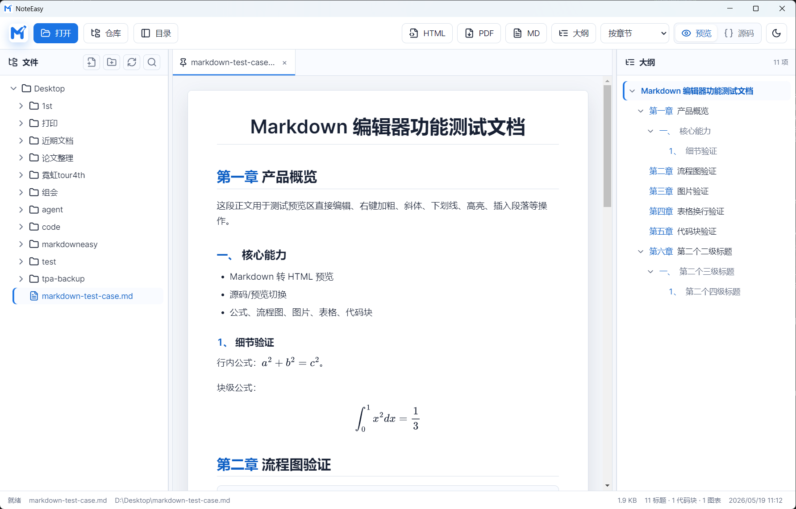

# NoteEasy

NoteEasy 是一个基于 Electron 的本地 Markdown 笔记与工作区应用。本仓库同时包含可独立运行的 MarkEasy 单网页编辑器，以及两者共用的 Markdown 数据模型、编辑视图和样式组件。

项目的核心目标是让编辑器能力只维护一份：标题、正文、图片、表格、公式、流程图、任务列表、导出等功能统一在公共组件中实现，NoteEasy 和 MarkEasy 自动复用这些更新。



## 主要功能

### Markdown 编辑器

- Markdown 源码与可视化预览编辑切换
- 文档大纲生成、定位、折叠和宽度调整
- 标题自动编号与保存
- 表格、图片、链接、任务列表和代码块
- LaTeX 公式、Mermaid 流程图、ECharts 图表、ABC 五线谱
- 导出 HTML、PDF 和 Markdown
- 本地图片相对路径引用
- VS Code 风格预览页签与双击锁定页签

### NoteEasy 工作区

- 同时添加多个本地目录
- 单独添加 Git 仓库目录
- 添加网络 Markdown 文件或网络目录清单
- 新建、重命名、移动和删除本地文件
- 文件搜索、目录折叠和自动刷新
- 自动保存与 `Ctrl+S` 保存
- 恢复上次工作区和打开的文档

本地目录和 Git 仓库由用户添加时明确选择。选择“本地目录”不会因为目录中存在 `.git` 而自动显示成 Git 仓库。

## 项目结构

```text
NoteEasy/
|-- markdata.js          # 公共数据模型与工作区来源接口
|-- markcom.js           # 公共编辑器、大纲和文件目录视图
|-- markcom.css          # 公共编辑器、预览、源码和导出样式
|-- markeasy.html        # MarkEasy 独立单网页入口
|-- noteeasy.html        # NoteEasy Electron 页面入口
|-- noteeasy.css         # NoteEasy 工作区和三栏布局样式
|-- noteeasy.js          # NoteEasy 页签、工作区和自动保存逻辑
|-- main.js              # Electron 主进程与文件系统 IPC
|-- preload.js           # Electron 安全桥接接口
|-- vendor/              # 已本地化的前端运行依赖
|-- assets/              # 应用图标
|-- image/               # README 和测试图片
|-- image-reference-tests/
|   `-- root-relative-image.md
|-- markdown-test-case.md
|-- test-102-heading-numbering-takeover.md
|-- package.json
`-- README.md
```

## 组件架构

项目分为公共组件层和宿主应用层。

### 数据模型

`markdata.js` 提供两个主要模型：

- `MarkDocument`：保存 Markdown 内容、标题大纲和文档块数据。
- `DirectoryFileDataModel`：保存工作区目录、文件节点和选择状态。

文档模型可以继续扩展正文、标题、图片、表格、公式、图表等子对象，并为子对象增加 renderer、DOM 或服务器协同能力。

工作区来源通过统一接口抽象：

```js
list
read
save
createFile
createFolder
rename
delete
move
show
watch
```

相关公共类型包括：

```js
window.MarkData.WorkspaceSourceAdapter
window.MarkData.WorkspaceSourceRegistry
window.MarkData.workspaceSourceOperations
```

### 公共视图

`markcom.js` 提供三个主要视图：

- `DocumentEditorView`：文档编辑和预览。
- `DocumentOutlineView`：文档大纲。
- `DirectoryFileView`：工作区目录和文件树。

这些视图订阅对应的数据模型。模型变化后通知视图更新，宿主页面不需要重复实现 Markdown 编辑器。

### 宿主应用

MarkEasy 只加载公共编辑器组件，适合单文档编辑。

NoteEasy 在公共编辑器外增加：

- 多工作区管理
- 本地文件系统访问
- 网络文件访问
- 页签管理
- 自动保存
- Electron IPC
- 左侧工作区、中间编辑器、右侧大纲布局

## 环境要求

- Node.js 18 或更高版本，推荐 Node.js 20 LTS
- npm 9 或更高版本
- Windows 10/11 为当前主要测试环境

项目运行时使用的 Markdown、图表、公式和 PDF 前端库已经放在 `vendor/` 中。NoteEasy 启动后不需要从 CDN 下载这些 JS 文件。

首次安装仍需联网下载 npm 中的 Electron 和构建依赖。

## 安装

```bash
git clone https://github.com/hztohhhhh/NoteEasy.git
cd NoteEasy
npm install
```

如果需要严格按照 `package-lock.json` 安装：

```bash
npm ci
```

## 启动 NoteEasy

```bash
npm start
```

`npm start` 会执行 `electron .`，由 `main.js` 创建窗口并加载 `noteeasy.html`。

不要直接使用浏览器打开 `noteeasy.html`。工作区、本地文件读写和自动保存依赖 Electron 的 `preload.js` 与主进程 IPC；直接用浏览器打开时会提示需要通过 Electron 启动。

### 添加工作区

启动后点击工具栏中的“工作区”：

1. “本地目录”：添加普通本地文件夹，以文件夹图标显示。
2. “Git 仓库”：添加本地 Git 仓库，以 Git 图标显示。
3. “网络文件”：输入 HTTP 或 HTTPS Markdown 地址。

网络来源默认只读。本地目录和 Git 仓库支持文件创建、保存、重命名、移动和删除。

### 页签规则

- 单击 Markdown 文件：使用预览页签打开，标题为斜体。
- 单击其他文件：未锁定的预览页签会被替换。
- 双击页签：锁定页签，标题恢复正体。
- 已锁定页签只能通过关闭按钮关闭。
- 文档被修改后会保留在页签中，并进入自动保存流程。

## 使用 MarkEasy

`markeasy.html` 是独立单网页入口，可以直接用浏览器打开：

```text
NoteEasy/markeasy.html
```

它引用以下公共组件：

```html
<link rel="stylesheet" href="markcom.css">
<script src="markdata.js"></script>
<script src="markcom.js"></script>
```

MarkEasy 支持单文档打开、编辑、预览、源码切换以及 HTML、PDF、Markdown 导出。

浏览器安全策略可能限制网页直接读取任意本地文件路径。需要完整本地文件系统和工作区能力时，请使用 NoteEasy。

## 本地图片

推荐把图片放在工作区内部，并使用 Markdown 路径：

```markdown

```

NoteEasy 会依次尝试：

1. 相对当前 Markdown 文件所在目录查找。
2. 相对当前工作区根目录查找。

预览时组件会把实际路径转换成可加载的本地文件 URL，保存源码时仍保留原始 Markdown 路径，不会写入大段 Base64 数据。

测试文件：

```text
image-reference-tests/root-relative-image.md
```

测试图片：

```text
image/screenshot.png
```

## 开发与复用

新增两个宿主都需要的编辑器能力时，优先修改公共组件：

| 修改内容 | 文件 |
| --- | --- |
| 文档结构、文档块、大纲数据 | `markdata.js` |
| 编辑、插入、渲染、导出和公共交互 | `markcom.js` |
| 编辑器、Markdown 和导出公共样式 | `markcom.css` |
| NoteEasy 工作区、页签和自动保存 | `noteeasy.js` |
| NoteEasy 专属布局 | `noteeasy.css` |
| Electron 文件系统和网络实现 | `main.js`、`preload.js` |

例如新增一种 Markdown 插入功能，应在 `markcom.js` 中实现；MarkEasy 和 NoteEasy 都会获得该功能，不需要复制两份代码。

扩展 WebDAV、GitHub API、对象存储或企业知识库时，应新增工作区 source adapter 或 IPC 实现，并保持公共工作区操作接口不变。

## 验证

基础语法检查：

```bash
node --check main.js
node --check preload.js
node --check markdata.js
node --check markcom.js
node --check noteeasy.js
```

手动功能检查：

1. 执行 `npm start`。
2. 添加一个本地目录，确认显示文件夹图标。
3. 添加一个 Git 仓库，确认显示 Git 图标。
4. 打开多个 Markdown 文件，验证预览页签替换和双击锁定。
5. 修改文档并等待自动保存，再重新打开确认内容。
6. 验证大纲定位、折叠以及左右面板宽度调整。
7. 打开 `image-reference-tests/root-relative-image.md`，确认相对路径图片正常显示。
8. 验证 HTML、PDF 和 Markdown 导出。

## 打包

生成未安装的应用目录：

```bash
npm run pack
```

生成 Windows 安装包：

```bash
npm run dist:win
```

其他平台：

```bash
npm run dist:mac
npm run dist:linux
```

构建产物默认写入 `release/`，该目录不会提交到 Git。

## Git 提交范围

仓库应提交：

- HTML、CSS 和 JavaScript 源码
- `package.json` 与 `package-lock.json`
- `vendor/` 本地运行依赖
- `assets/` 图标
- 测试 Markdown 和测试图片
- README 与 LICENSE

仓库不应提交：

- `node_modules/`
- `release/`
- `release-check/`
- `dist/`
- Electron 可执行文件
- `.asar`、安装包和压缩包

这些内容已经由 `.gitignore` 排除。

## License

本项目使用 [MIT License](LICENSE)。
