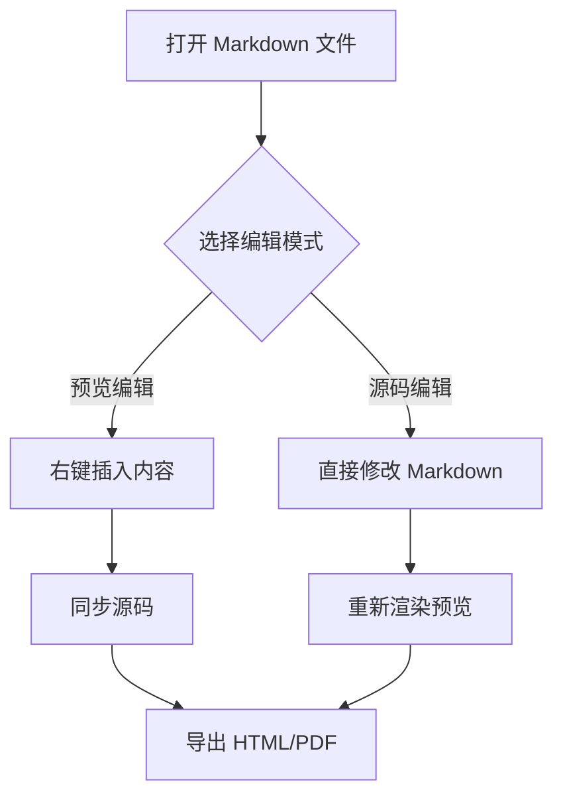

<!-- noteeasy:numbering=mode3 -->
# Markdown 编辑器功能测试文档

## 产品概览

这段正文用于测试预览区直接编辑、右键加粗、斜体、下划线、高亮、插入段落等操作。

### 核心能力

- Markdown 转 HTML 预览
- 源码/预览切换
- 公式、流程图、图片、表格、代码块

#### 细节验证

行内公式：$a^2+b^2=c^2$。

块级公式：

$$
\int_0^1 x^2 dx = \frac{1}{3}
$$

## 流程图验证




## 图片验证

<p class="image-block image-align-center"></p>

## 表格换行验证

<table>
  <thead>
    <tr>
      <th>模块</th>
      <th>测试点</th>
      <th>预期结果</th>
    </tr>
  </thead>
  <tbody>
    <tr>
      <td>表格</td>
      <td>单元格内第一行<br>单元格内第二行</td>
      <td>切换源码再切回预览后仍然是表格</td>
    </tr>
    <tr>
      <td>图片</td>
      <td>右键图片后更换地址、宽度、对齐</td>
      <td>图片保持指定大小和位置</td>
    </tr>
  </tbody>
</table>

## 代码块验证

```javascript
function helloMarkdownViewer(name) {
  return `Hello, ${name}`;
}

console.log(helloMarkdownViewer("Markdown"));
```

## 第二个二级标题

### 第二个三级标题

#### 第二个四级标题

用于测试三种标题编号方式的自动重算。
